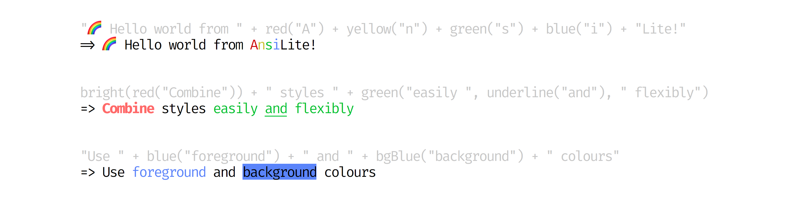

# 

> Quick and easy ANSI terminal functions for the JVM



## Use Case

AnsiLite is intended to provide an easy, intuitive API for producing ANSI coloured strings from JVM programs, with a minimal dependency chain. 

It is not intended to be a complete replacement for more fully featured libraries like JAnsi. You may, however, find AnsiLite easier to use and/or to have fewer dependency version conflicts.

AnsiLite also builds in special-case detection for run time environments, such as IDE or build tools, to make reasonable assumptions about terminal capabilities.

Coloured output requires a terminal that supports ANSI escape codes. If the terminal doesn't support ANSI, output will fall back to monochrome.

## Usage summary

AnsiLite provides a set of simple functions that can be used to apply Ansi colouring. The returned `AnsiLite` objects are can simply be `toString`ed to obtain the Ansi-encoded String form.

For example:

```java
red("Hello world").toString();
```

returns `"Hello world"` that, when output to an Ansi-capable terminal, will appear all in red.

In practice `toString()` is rarely necessary - these can instead be used anywhere that automatic string conversion takes place, such as string concatenation or logger placeholders.

The parameters to AnsiLite functions are varargs, and can also be nested:

```java
red("This", underline("is"), "nested");
```

will yield the entire string in red, with the word 'is' underlined as well.

The following functions are available for foreground colours:

* `black(...)`
* `red(...)`
* `green(...)`
* `yellow(...)`
* `blue(...)`
* `magenta(...)`
* `cyan(...)`
* `white(...)`

And background colours:

* `bgBlack(...)`
* `bgRed(...)`
* `bgGreen(...)`
* `bgYellow(...)`
* `bgBlue(...)`
* `bgMagenta(...)`
* `bgCyan(...)`
* `bgWhite(...)`

And modifiers:

* `underline(...)`
* `bright(...)`
* `dim(...)`
* `reverse(...)`

## Maven dependency

TODO - not yet released on Maven Central

    <dependency>
        <groupId>org.rnorth.ansilite</groupId>
        <artifactId>ansilite</artifactId>
        <version>2.2.0</version>
    </dependency>

## Controlling output


The library will attempt to detect terminal capabilities to determine whether it is appropriate to use ANSI (coloured) output. The basic logic is:

* If STDOUT is a TTY, ANSI coloured output will be used. Otherwise, ANSI colour codes will only be output if:
* running under Maven (latest versions of Maven will strip/preserve as appropriate)
* running under Gradle (latest versions of Gradle will strip/preserve as appropriate)
* running under IntelliJ IDEA

If it is necessary to override this for some reason, the `ansilite.enabled` may be set:

* `-Dansilite.enabled=true`: ANSI output will always be produced 
* `-Dansilite.enabled=false`: ANSI output will never be produced 

## License

See [LICENSE](LICENSE).

## Contributing

* Star the project on Github and help spread the word :)
* [Post an issue](https://github.com/rnorth/ansilite/issues) if you find any bugs
* Contribute improvements or fixes using a [Pull Request](https://github.com/rnorth/ansilite/pulls). If you're going to contribute, thank you! Please just be sure to:
	* discuss with the authors on an issue ticket prior to doing anything big
	* follow the style, naming and structure conventions of the rest of the project
	* make commits atomic and easy to merge
	* verify all tests are passing. Build the project with `mvn clean install` to do this.

## Copyright

Copyright (c) 2015-2017 Richard North.

See [AUTHORS](AUTHORS) for contributors.
